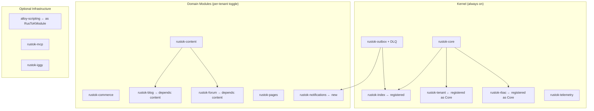

# RusToK — Architecture Improvement Recommendations

- Date: 2026-02-19
- Status: Proposed
- Author: Platform Architecture Review

---

## 1. Контекст: что мы видим в коде сегодня

Прежде чем давать рекомендации, зафиксируем реальное состояние системы.

### 1.1 Граница между ядром и опциональными модулями

Платформа делится на два непересекающихся слоя:

**Инфраструктурное ядро** — компилируется всегда, не отключается:

| Crate | Роль |
|---|---|
| `rustok-core` | Контракты, EventBus, RBAC, кэш, Circuit Breaker, метрики |
| `rustok-outbox` | Transactional outbox (AtLeastOnce delivery) |
| `rustok-iggy` + `rustok-iggy-connector` | L2 streaming transport |
| `rustok-telemetry` | OpenTelemetry, tracing, Prometheus |
| `rustok-tenant` | Multi-tenancy helpers |
| `rustok-rbac` | RBAC helpers |
| `rustok-test-utils` | Test infrastructure |

**Домен-модули** — регистрируются в `build_registry()`, управляются через `modules.toml`:

| Crate | Тип | Зависимость |
|---|---|---|
| `rustok-content` | Domain (required по манифесту) | `rustok-core` |
| `rustok-commerce` | Domain (optional) | `rustok-core` |
| `rustok-index` | Infrastructure-domain | `rustok-core` (не зарегистрирован!) |
| `rustok-blog` | Wrapper (optional) | `rustok-content` |
| `rustok-forum` | Wrapper (optional) | `rustok-content` |
| `rustok-pages` | Domain (optional) | `rustok-core` |

**Важное наблюдение:** `rustok-tenant` и `rustok-rbac` реализуют `RusToKModule` trait, но **не зарегистрированы** в `build_registry()`. `rustok-index` тоже реализует `IndexModule`, но также не зарегистрирован. Это создаёт архитектурную неопределённость.

---

## 2. Рекомендации

### 2.1 🔴 КРИТИЧНО: Устранить размытую границу core / domain-module

**Проблема.** `rustok-tenant` и `rustok-rbac` имеют `impl RusToKModule`, но не регистрируются. Это двусмысленно: либо это инфраструктурные crate'ы (тогда зачем им `RusToKModule`?), либо domain-модули (тогда почему они не в `build_registry()`?).

**Рекомендация.** Ввести формальную классификацию на уровне trait'а:

```rust
// В rustok-core/src/module.rs
pub enum ModuleKind {
    /// Всегда активен, не может быть отключён tenant'ом
    Core,
    /// Регистрируется в реестре, может быть включён/отключён per-tenant
    Optional,
}

pub trait RusToKModule: Send + Sync + MigrationSource {
    fn kind(&self) -> ModuleKind {
        ModuleKind::Optional  // default: опциональный
    }
    // ... остальное без изменений
}
```

Для `TenantModule`, `RbacModule`, `IndexModule` переопределить: `fn kind() -> ModuleKind::Core`.
`ModuleRegistry` должен при регистрации Core-модулей сохранять их в отдельный `core_modules: HashMap`, чтобы `ModuleLifecycleService::toggle_module()` отклонял попытку отключения с ошибкой `ToggleModuleError::CoreModuleCannotBeDisabled`.

---

### 2.2 🔴 КРИТИЧНО: Зарегистрировать `rustok-index` в `build_registry()`

**Проблема.** `rustok-index` существует, реализует `IndexModule`, но **не зарегистрирован**. CQRS-логика (`Bus → Index → DB_Read`) работает только если `IndexModule` слушает события. Без регистрации read-модели не обновляются.

**Рекомендация.** Добавить в `apps/server/src/modules/mod.rs`:

```rust
use rustok_index::IndexModule;

pub fn build_registry() -> ModuleRegistry {
    ModuleRegistry::new()
        .register(IndexModule)       // ← infrastructure/core
        .register(ContentModule)
        .register(CommerceModule)
        .register(BlogModule)
        .register(ForumModule)
        .register(PagesModule)
}
```

`IndexModule` должен иметь `kind() -> ModuleKind::Core` — его нельзя отключать, т.к. он критичен для read-path.

---

### 2.3 🟡 ВАЖНО: Зарегистрировать `TenantModule` и `RbacModule`

**Проблема.** `TenantModule` и `RbacModule` реализуют `RusToKModule` с `health()`, но не зарегистрированы. Это означает:
- Их health-статус не включён в `/health/modules`.
- Их `on_enable`/`on_disable` хуки никогда не вызываются.
- Миграции (если появятся) нужно будет добавлять вручную.

**Рекомендация.** Зарегистрировать как Core-модули (см. п. 2.1):

```rust
use rustok_tenant::TenantModule;
use rustok_rbac::RbacModule;

ModuleRegistry::new()
    .register(TenantModule)   // Core, non-disableable
    .register(RbacModule)     // Core, non-disableable
    .register(IndexModule)    // Core
    .register(ContentModule)
    // ...
```

---

### 2.4 🟡 ВАЖНО: Согласовать `modules.toml` с реальностью `build_registry()`

**Проблема.** `modules.toml` — декларативный манифест, но `build_registry()` — императивный Rust-код. Сегодня они могут расходиться: в `modules.toml` есть `index` и `outbox`, но в `build_registry()` их нет.

**Рекомендация.** Либо:
1. **Генерировать `build_registry()` из `modules.toml`** (через xtask/build.rs) — единый source of truth.
2. **Добавить проверку на старте** — сравнивать содержимое `modules.toml` с реально зарегистрированными slug'ами и завершать процесс с ошибкой при расхождении.

Второй вариант быстрее реализовать:

```rust
// В app.rs, после build_registry()
let registry = modules::build_registry();
modules::validate_registry_vs_manifest(&registry)
    .expect("modules.toml is out of sync with build_registry()");
```

---

### 2.5 🟡 ВАЖНО: Добавить `is_required` / `dependencies` для Content-модуля

**Проблема.** `rustok-blog` и `rustok-forum` — это wrapper-модули поверх `rustok-content`. Если `content` отключить через `toggle_module()`, `blog` и `forum` сломаются без явной ошибки. Сейчас `dependencies()` в `BlogModule` и `ForumModule` возвращает `&[]`.

**Рекомендация.** Заполнить зависимости:

```rust
// В BlogModule
fn dependencies(&self) -> &[&'static str] {
    &["content"]
}

// В ForumModule
fn dependencies(&self) -> &[&'static str] {
    &["content"]
}
```

`ModuleLifecycleService` уже проверяет зависимости при `toggle_module(enabled=true)` и наличие зависимых при `toggle_module(enabled=false)`. Достаточно только заполнить поле.

---

### 2.6 🟡 ВАЖНО: Ввести `required` флаг в `modules.toml`

**Проблема.** В `modules.toml` нет способа пометить модуль как неотключаемый. Комментарий `# Core modules (required)` — это просто комментарий, а не машиночитаемое ограничение.

**Рекомендация.** Расширить схему манифеста:

```toml
[modules]
content = { crate = "rustok-content", source = "path", path = "crates/rustok-content", required = true }
index   = { crate = "rustok-index",   source = "path", path = "crates/rustok-index",   required = true }

commerce = { crate = "rustok-commerce", source = "path", path = "crates/rustok-commerce" }
blog     = { crate = "rustok-blog",     source = "path", path = "crates/rustok-blog",     depends_on = ["content"] }
forum    = { crate = "rustok-forum",    source = "path", path = "crates/rustok-forum",     depends_on = ["content"] }
pages    = { crate = "rustok-pages",    source = "path", path = "crates/rustok-pages" }
```

Это позволит xtask/CLI инструментам и документации автоматически знать, что можно включать/отключать.

---

### 2.7 🟢 УЛУЧШЕНИЕ: Вынести `DomainEvent` из `rustok-core` в `rustok-events`

**Проблема.** `rustok-core/src/events/types.rs` содержит 37 556 байт — это огромный enum с событиями для content, blog, forum, commerce, user, pages, tenants, MCP. При добавлении нового модуля разработчик вынужден редактировать core, что нарушает принцип Open/Closed.

```rust
// сегодня: всё в одном месте
pub enum DomainEvent {
    NodeCreated { ... },      // content
    ProductCreated { ... },   // commerce
    OrderPlaced { ... },      // commerce
    PostPublished { ... },    // blog
    TopicCreated { ... },     // forum
    PagePublished { ... },    // pages
    // ...50+ вариантов
}
```

**Рекомендация.** Ввести паттерн расширяемых событий через типизированные "пространства":

```rust
// В rustok-core: только инфраструктурные события + envelope
pub enum CoreEvent {
    UserRegistered { user_id: Uuid, email: String },
    UserLoggedIn { user_id: Uuid },
    TenantCreated { tenant_id: Uuid },
}

// Каждый модуль объявляет свои события сам:
// rustok-commerce/src/events.rs
pub enum CommerceEvent {
    ProductCreated { product_id: Uuid },
    OrderPlaced { order_id: Uuid, tenant_id: Uuid },
}

// EventEnvelope параметризуется по payload:
pub struct EventEnvelope<E = serde_json::Value> {
    pub event_type: String,
    pub tenant_id: Uuid,
    pub event: E,
    // ...
}
```

Это Breaking Change, требует ADR. Приоритет: реализовать до появления первого production tenant.

---

### 2.8 🟢 УЛУЧШЕНИЕ: Добавить per-tenant module settings

**Проблема.** `tenant_modules.settings` (JSONB) уже существует в модели, но нигде не используется. `ModuleContext.config` принимает `&Value`, но сервисы его игнорируют.

**Рекомендация.** Ввести типизированный конфиг для модулей:

```rust
pub trait RusToKModule {
    type Config: DeserializeOwned + Default;

    fn parse_config(&self, raw: &Value) -> Result<Self::Config> {
        serde_json::from_value(raw.clone()).map_err(|e| Error::config(e))
    }
}
```

Это откроет возможность per-tenant настройки: лимиты постов для блога, список валют для commerce, кастомные SEO-поля и т.д.

---

### 2.9 🟢 УЛУЧШЕНИЕ: Добавить `rustok-notifications` как опциональный инфраструктурный модуль

**Проблема.** В RBAC и Events нет общего механизма уведомлений. Сейчас если нужно отправить email при `OrderPlaced` — это пишется в ad-hoc обработчиках.

**Рекомендация.** Создать `crates/rustok-notifications`:
- Подписывается на `DomainEvent` через EventBus.
- Поддерживает каналы: email (уже есть `apps/server/src/services/email.rs`), webhook, in-app.
- Конфигурируется per-tenant через `tenant_modules.settings`.
- Является опциональным Optional-модулем (не Core).

---

### 2.10 🟢 УЛУЧШЕНИЕ: Улучшить Outbox: добавить DLQ и мониторинг backlog

**Проблема.** `OutboxRelay::process_pending_once()` логирует ошибки но не отправляет застрявшие события в Dead Letter Queue. Нет метрик по backlog size.

**Рекомендация.**
1. Добавить `outbox_backlog_size` gauge в Prometheus metrics (экспортировать через `/metrics`).
2. Реализовать DLQ: после N попыток (конфигурируемое) переносить события в таблицу `sys_events_dlq`.
3. Добавить API endpoint `GET /api/admin/events/dlq` для просмотра и replay застрявших событий.

Базовый скелет DLQ уже есть в `crates/rustok-iggy/src/dlq.rs` — можно портировать логику в outbox-уровень.

---

### 2.11 🟢 УЛУЧШЕНИЕ: Формализовать Alloy Scripting как опциональный модуль

**Проблема.** `alloy-scripting` подключается напрямую в `app.rs` через `alloy_scripting::create_default_engine()` — минуя ModuleRegistry. Это нарушает единообразие модульной архитектуры.

**Рекомендация.** Обернуть в `RusToKModule`:

```rust
pub struct AlloyModule;

impl RusToKModule for AlloyModule {
    fn slug(&self) -> &'static str { "alloy" }
    fn kind(&self) -> ModuleKind { ModuleKind::Optional }
}
```

Это позволит:
- Включать/отключать скриптовый движок per-tenant.
- Отображать состояние в `/health/modules`.
- Ограничивать доступ через RBAC (`scripting:execute` permission).

---

### 2.12 🔵 СТРАТЕГИЧЕСКИ: Разделить `apps/server` на `core-server` + `module-bundles`

**Проблема.** Сейчас в `apps/server/src/app.rs` все маршруты (`commerce`, `blog`, `forum`, `content`, `pages`) захардкожены. При добавлении нового модуля нужно менять `app.rs`. Это создаёт coupling.

**Рекомендация.** Ввести автоматическую регистрацию роутов через trait:

```rust
pub trait HttpModule: RusToKModule {
    fn routes(&self) -> axum::Router;
}

// В app.rs:
fn routes(ctx: &AppContext) -> AppRoutes {
    let registry = modules::build_registry();
    let mut routes = AppRoutes::with_default_routes()
        .add_route(controllers::health::routes())
        .add_route(controllers::auth::routes())
        .add_route(controllers::graphql::routes());

    for module in registry.http_modules() {
        routes = routes.add_route(module.routes());
    }
    routes
}
```

Это позволит добавлять новые модули без изменения `app.rs`.

---

## 3. Приоритизированный план действий

| # | Рекомендация | Приоритет | Сложность | Блокирует |
|---|---|---|---|---|
| 2.2 | Зарегистрировать `rustok-index` | 🔴 Критично | Низкая | CQRS read path |
| 2.5 | Заполнить `dependencies()` для Blog/Forum | 🔴 Критично | Низкая | Data integrity |
| 2.1 | Ввести `ModuleKind::Core` / `Optional` | 🔴 Критично | Средняя | All guards |
| 2.3 | Зарегистрировать Tenant/RBAC как Core | 🟡 Важно | Низкая | Health visibility |
| 2.4 | Синхронизация `modules.toml` ↔ `build_registry()` | 🟡 Важно | Средняя | Ops reliability |
| 2.6 | `required` / `depends_on` в `modules.toml` | 🟡 Важно | Низкая | Ops tooling |
| 2.10 | Outbox DLQ + backlog metrics | 🟢 Улучшение | Средняя | Event reliability |
| 2.8 | Per-tenant typed module config | 🟢 Улучшение | Средняя | Extensibility |
| 2.11 | Alloy как `RusToKModule` | 🟢 Улучшение | Низкая | Consistency |
| 2.9 | `rustok-notifications` модуль | 🟢 Улучшение | Высокая | New capability |
| 2.7 | Вынести `DomainEvent` из core | 🔵 Стратегически | Высокая | Extensibility |
| 2.12 | Авторегистрация HTTP routes | 🔵 Стратегически | Высокая | DX / scalability |

---

## 4. Итоговая картина после применения рекомендаций



---

## 5. Связанные документы

- [`docs/architecture/overview.md`](./overview.md) — архитектурный обзор
- [`docs/architecture/principles.md`](./principles.md) — принципы архитектуры
- [`docs/architecture/events.md`](./events.md) — транзакционная публикация событий
- [`docs/modules/registry.md`](../modules/registry.md) — реестр компонентов
- [`docs/modules/overview.md`](../modules/overview.md) — состояние модулей
- [`DECISIONS/`](../../DECISIONS/) — архитектурные решения (ADR)
