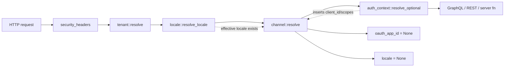
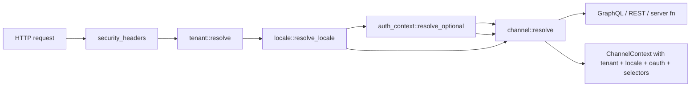
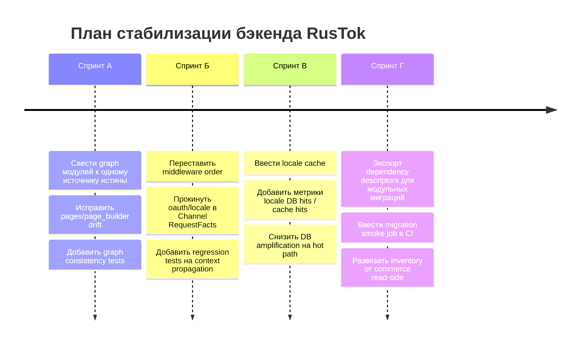

# Аудит бэкенда RusTok и план устранения

## Executive summary

Главная проблема RusTok сейчас не в незавершённом FFA/FBA-треке, а в том, что текущий бэкенд уже страдает от **дрейфа источников истины**, **неполного request-context контракта** и **чрезмерно централизованной композиции модулей и миграций**. Самые опасные дефекты, которые стоит исправлять в первую очередь: расхождение между `modules.toml`, runtime-регистрацией и центральным реестром модулей; неполный `Channel`-контекст в middleware; лишний DB-round-trip на каждый запрос для tenant-locales; скрытая межмодульная зависимость inventory → commerce GraphQL; ручная и хрупкая сборка общего набора миграций. При этом у проекта уже есть сильная база в CI: проверки формата, clippy, workspace check, security audit, coverage, SBOM и экспорт reference artifacts. То есть база для стабилизации есть, но её нужно довести до runtime-consistency и migration-safety. citeturn52view0turn19view0turn48view0turn43view0turn28view2turn29view5turn35view0turn38view0

## Контекст и допущения

Включённый коннектор в рамках задачи — **GitHub**; анализ ограничен только репозиторием `RusTokRs/RusTok`, как вы и просили. Трек FFA/FBA в этом отчёте **не оценивается как целевое состояние** и не используется как критерий “правильно/неправильно”; я упоминаю его только там, где текущие артефакты уже создают runtime-долг или dependency drift.

Явные допущения для плана работ.  
Целевая нагрузка не указана. Окружения деплоя не указаны. SLA и требования к латентности не указаны. Формат оценки выбран в **человеко-часах**. Из кода и конфигов можно уверенно вывести только то, что проект ориентирован как минимум на PostgreSQL и GitHub Actions CI, а прод-конфиг предусматривает Redis для rate limiting и отключённый `auto_migrate`. Это важно, потому что часть рекомендаций ниже касается именно shared-DB / shared-schema и поведения middleware под многотенантной нагрузкой. citeturn40view0turn42view0turn38view0turn43view0

Приоритет внешних источников в этом отчёте такой:  
сначала — **код и docs самого репозитория** как первоисточник текущего состояния; затем — **официальная документация axum** для фактического порядка middleware; затем — **RFC 9110** и **W3C i18n best practices** для языкового HTTP-контракта и нормализации language tags. citeturn53search0turn53search2turn54search5

## Ключевые выводы

### Дрейф источников истины по модулям уже материализовался в коде

В репозитории одновременно живут минимум три слоя, описывающие состав модулей и их зависимости: `modules.toml`, runtime-регистрация через `apps/server/src/modules/mod.rs`, и центральный реестр `docs/modules/registry.md`. Архитектурно это допустимо только при очень жёсткой синхронизации, но сейчас видно фактическое расхождение: `modules.toml` и центральный реестр указывают, что модуль `pages` зависит от `content` и `page_builder`, тогда как runtime-contract test в `apps/server/src/modules/mod.rs` проверяет для `pages` только зависимость от `content`. Это уже не теоретический риск, а конкретный drift в platform contract. citeturn52view0turn19view0turn48view0

Это особенно опасно потому, что архитектурные docs прямо называют `modules.toml` каноническим источником состава платформы, а `docs/modules/registry.md` — синхронизируемой картой ownership. При текущем рассогласовании любое изменение зависимости, tenant-enable логики, UI wiring или installer/runtime composition может повести себя по-разному в разных слоях системы. Для разработчика это означает повышенную вероятность “зелёного CI, но неверного runtime-смысла”. citeturn45search3turn30search4turn48view0

Отдельный антипаттерн здесь — чрезмерная централизация логики вокруг `apps/server/src/modules/manifest.rs`: файл имеет 4867 строк и через `mod.rs` реэкспортирует сразу parsing, diff, catalog, build plan, UI classification и validation-функции. Это классический “god-file”: широкая зона изменения, тяжёлая reviewability, сложная точечная изоляция тестов и повышенный шанс скрытых побочных эффектов. citeturn14view2turn19view0

### Request-context контракт на уровне middleware неполный и местами нарушает собственную архитектурную политику

Документ `docs/architecture/api.md` фиксирует, что **каждый API path** должен идти через единый runtime context: tenant resolution, request-scoped `ChannelContext`, auth/session handling, RBAC, locale и observability hooks. В коде видно, что `auth_context` действительно извлекает и кладёт в extension не только `user_id` и `session_id`, но и `client_id`, `scopes`, `grant_type`. Однако `channel` middleware при построении `RequestFacts` жёстко выставляет `oauth_app_id: None` и `locale: None`. Иными словами, транспортный контракт моделирует эти измерения, но текущая реализация их не протаскивает. citeturn43view0turn46view2turn28view2

Это не просто некрасиво. Канальный резолвер и его cache key сейчас лишаются части входных факторов, которые уже существуют в системе как first-class context. Если канал или policy когда-либо должны различаться по OAuth app / grant context или по locale, текущее поведение будет давать неверное разрешение канала или лишит вас возможности безопасно расширить policy model без ломающего рефакторинга middleware. citeturn28view2turn46view2turn43view0

Дополнительно здесь есть важный нюанс порядка middleware. Axum документирует, что при последовательных `.layer(...)` middleware исполняются **снизу вверх**. В `compose_application_router` текущий стек написан так, что `auth_context` расположен ниже `channel`, а значит на входе запроса `channel` выполняется **раньше** `auth_context`; соответственно, даже при желании он не увидит `client_id` из `AuthContextExtension`, потому что тот ещё не вставлен. `locale` расположен выше `channel` и успевает выполниться раньше, но `channel` всё равно игнорирует locale явно. Получается двойная проблема: часть контекста не попадает из-за порядка, часть — из-за кода. citeturn20view0turn46view2turn28view2turn53search0

### Локализация сейчас функциональна, но её runtime-реализация плохо масштабируется

`locale` middleware после определения effective locale делает запрос в таблицу `tenant_locales` через `load_tenant_locales`, затем ограничивает effective locale по tenant settings и выставляет `Content-Language` в ответ. Это означает, что в многотенантном режиме один обычный HTTP request получает дополнительный запрос в БД на чтение локалей арендатора. В коде этого middleware не видно локального кэша, versioned invalidation или preloaded tenant locale snapshot. При умеренной и высокой нагрузке это превращает i18n из дешёвой transport-функции в постоянный DB-multiplier. citeturn29view5turn28view3turn29view4

С точки зрения HTTP-семантики направление правильное: язык представления действительно должен быть выражен через language tags, а `Content-Language` — допустимый и ожидаемый механизм. Но когда система уже дошла до request-scoped locale, следующий обязательный шаг — сделать этот контекст дешёвым и предсказуемым. W3C прямо рекомендует использовать устойчивые language tags для locale preference и держать их минимально необходимыми; RFC 9110 фиксирует роль language tags в `Accept-Language` и `Content-Language`. Сейчас же у RusTok языковой контракт есть, а дешёвой runtime-реализации — нет. citeturn53search2turn54search1turn54search5turn29view5

### Межмодульные зависимости протекают через транспортный слой

Очень показательный симптом — `crates/rustok-inventory/admin/README.md`: inventory admin UI прямо описан как пакет, который для текущего read-side использует `rustok-commerce` GraphQL contract для product/variant visibility, пока dedicated inventory transport ещё “split out”. Для текущей разработки это может быть удобным шорткатом, но архитектурно это означает, что inventory-ownership ещё не замкнут на собственный transport seam и остаётся чувствительным к эволюции commerce API. citeturn44search0turn43view0

Это противоречит общей политике проекта, где backend/domain contract должен оставаться за модулем, а host и UI packages не должны становиться canonical owner API logic; более того, docs по modules прямо запрещают package-local shortcuts и рекомендуют module-owned UI и transport wiring через manifest. Пока inventory читает commerce GraphQL как фактический read-side backend, любой рефакторинг commerce-схемы создаёт каскадный риск для inventory UI даже там, где доменная ответственность должна быть независимой. citeturn43view0turn30search3turn45search3

### Миграционный слой слишком централизован и хрупок для роста модульной платформы

`apps/server/migration/src/lib.rs` вручную агрегирует платформенные миграции, затем вручную `extend`-ит миграции доменных crate-ов, затем сортирует всё лексикографически, а поверх этого применяет dependency sort по descriptor’ам. Ключевая проблема не в самой идее, а в том, что сейчас `collect_migration_descriptors()` собирает dependency metadata только из `rustok_product`, при том что в мигратор подключены десятки других модулей. Это означает, что cross-module порядок для большинства модулей по факту пока остаётся на lexical convention, а не на явно выраженном dependency graph. citeturn34view0turn35view0

Файл мигратора сам по себе — уже operational hotspot: в одном месте перечислены platform-core миграции, модульные миграции, сортировка, dependency validation и тесты. Дополнительный красный флаг — наличие `#[ignore]` диагностического теста `sqlite_migrations_apply_incrementally`, который прямо помечен как helper для поиска первой SQLite-incompatible migration. Это полезная диагностика для автора, но в текущем виде она не защищает CI и никак не гарантирует, что incremental schema evolution безопасно воспроизводится в тестовом pipeline. citeturn35view0

Важно и то, что docs по модулям сами фиксируют текущую модель как shared DB/shared schema, где tenant isolation — это runtime/application boundary, а broad RLS big-bang прямо запрещён без отдельного ADR и rollback plan. Значит, безопасный порядок миграций и корректная cross-module schema composition для RusTok — не “желательно”, а центральный механизм предотвращения межтенантных и межмодульных инцидентов. citeturn43view0turn45search3

### CI уже сильный, но ему не хватает migration-safety и performance-gates

CI-пайплайн объективно хороший: форматирование, clippy, workspace check, MSRV check, `cargo-audit`, `cargo-deny`, typo check, docs, `cargo udeps`, coverage, SBOM, nextest, Next.js jobs, reference artifacts export, freshness checks по snapshot docs. Это сильнее среднего по open-source Rust-проектам и даёт хорошую основу для наведения порядка. citeturn38view0

Но при этом в workflow не видно отдельного обязательного job’а на **миграции с нуля / up / smoke validation / rollback rehearsal**, нет отдельного performance regression этапа, и нет gate’а на runtime-context invariants вроде “channel cache key varies by oauth app and locale” или “module graph from `modules.toml` equals runtime registry edges”. То есть CI хорошо ловит синтаксические и контрактные изменения, но всё ещё недостаточно контролирует **операционную сторону платформенной композиции**. citeturn38view0turn35view0

## Сравнение текущего и целевого состояния

| Область | Текущее состояние | Желаемое состояние |
|---|---|---|
| API-контракты | Формально зафиксирован единый host/runtime context, но `channel` сейчас строит `RequestFacts` с `oauth_app_id: None` и `locale: None`; inventory admin временно читает `rustok-commerce` GraphQL как внешний read-side. citeturn43view0turn28view2turn44search0 | Каждый transport path получает полный tenant/auth/channel/locale context; module-owned UI читает только module-owned transport или явно задокументированный compatibility facade. |
| Локализация | Request-scoped locale есть, `Content-Language` выставляется, но tenant-locales грузятся запросом в БД на каждый request. citeturn29view5turn28view3turn53search2 | Locale resolution нормализован по language-tag best practices и обслуживается через кэш/снапшот с явной invalidation-стратегией. |
| Масштабируемость | Модульная и миграционная композиция держится на больших центральных точках (`manifest.rs`, `migration/lib.rs`); hidden DB amplification в locale middleware. citeturn14view2turn33view0turn29view5 | Composition разбита по ownership seam, а runtime middleware не делает лишних DB-round-trip на горячем пути. |
| Отказоустойчивость | Есть rate limiting, security headers и reference-artifact checks, но нет отдельного CI gate на миграционные сценарии и runtime-context regression. citeturn38view0turn28view1 | Есть обязательные migration smoke/rollback checks, invariant tests на module graph и request context propagation, плюс наблюдаемость по горячим middleware. |
| Безопасность | Базовые security headers реализованы; auth поддерживает RS256, но default-path остаётся HS256, а production example опирается на shared secret-конфиг. citeturn28view0turn13view3turn42view0 | Полный hardening-путь: явная policy по algorithm selection, rotation, secrets management, audit на tenant/channel/auth invariants и метрики отказов. |

## План устранения

### Приоритеты и порядок работ

Ниже — план, ориентированный на **снижение архитектурного риска**, а не на косметическую чистку. Оценка в человеко-часах, без учёта внешних согласований с product/ops.

| Приоритет | Поток работ | Оценка | Что сделать | Критерий завершения |
|---|---:|---:|---|---|
| **Критично** | Убрать drift источников истины по модулям | 20 ч | Свести модульный graph к одному каноническому builder’у; исправить расхождение `pages` ↔ `page_builder`; сделать CI-check “`modules.toml` == runtime registry edges == central registry snapshot”. | PR с исправлением расхождения, тест на equality графов, зелёный CI. |
| **Критично** | Починить propagation request context | 24 ч | Переставить порядок middleware; прокинуть `client_id`/oauth app и locale в `channel` request facts; добавить regression tests на порядок слоёв и cache key. | `channel` видит tenant + locale + auth context; tests подтверждают корректный order и key variance. |
| **Высокий** | Убрать DB-hit на locale path | 18 ч | Ввести кэш tenant locale snapshot по `tenant_id` с TTL или version-based invalidation; вынести load path из hot request в shared service. | p95 locale-resolution без БД на cache-hit; метрики cache hit/miss присутствуют. |
| **Высокий** | Развязать inventory от commerce read-side | 28 ч | Ввести inventory-owned transport facade для нужных read-моделей; оставить compatibility adapter временно, но скрыть его за inventory service boundary. | Inventory UI не зависит напрямую от commerce GraphQL schema. |
| **Высокий** | Сделать миграции dependency-driven, а не lexical-driven | 22 ч | Для каждого модульного crate экспортировать dependency descriptors; поднять check на duplicate/missing/cycle до обязательного CI gate; добавить smoke job на пустую БД. | Все модульные миграции имеют explicit descriptors там, где есть cross-module FK/order dependency. |
| **Средний** | Усилить CI/CD для runtime safety | 16 ч | Добавить job: migrate empty DB → start server → export artifacts; отдельный job на migration smoke/rollback rehearsal; invariant tests для module graph. | CI валит PR при нарушении миграционного порядка или графа модулей. |
| **Средний** | Hardening auth/config | 12 ч | Зафиксировать production policy: algorithm, key source, rotation notes, secret validation at boot; добавить config-lint. | Сервер не стартует с weak/missing prod auth config. |
| **Низкий** | Декомпозировать hotspots | 24 ч | Разбить `apps/server/src/modules/manifest.rs` и `apps/server/migration/src/lib.rs` на ownership-oriented submodules. | Крупные “god-files” разбиты, изменяемость локализована. |

Итого базовый стабилизационный контур — **140 ч**. Это реалистичный объём на 2–3 инженерные недели одного сильного backend-разработчика или 1–1.5 недели для двух разработчиков при хорошем code review потоке.

### Последовательность реализации

Сначала надо закрыть **дрейф composition graph** и **request-context pipeline**. Это два дефекта, которые масштабируют другие проблемы: пока не синхронизирован граф модулей, опасно трогать install/runtime hooks; пока middleware не передаёт полный контекст, трудно стабилизировать канал, локализацию, headless API и observability. citeturn52view0turn19view0turn28view2turn46view2turn53search0

После этого — **locale caching** и **migration dependency descriptors**. Эти работы снижают operational risk и улучшают серверный hot path без завязки на незавершённые UI-треки. Далее уже можно безопасно делать transport-untangling для inventory и прочих read-side сшивок. citeturn29view5turn35view0turn44search0

### Изменения в API-контрактах

Здесь нужен не большой redesign, а жёсткое выравнивание уже заявленных правил.

Нужно зафиксировать, что `ChannelContext` строится из **tenant + locale + auth-derived oauth dimension + request selectors**, а не из обрезанного набора заголовков и query-параметров. Это не меняет внешний API shape, но меняет контракт runtime-поведения и therefore требует обновить docs и tests как contract change. citeturn43view0turn28view2turn46view2turn53search0

Для inventory нужен transitional contract:  
inventory-owned service/facade возвращает тот же UI-необходимый read model, но совместимость с текущим commerce GraphQL держится временно внутри адаптера, а не на уровне admin package. Тогда ломающие изменения commerce-поверхности перестанут быть прямым риском для inventory UI. citeturn44search0turn43view0

### Изменения в БД и миграциях

Здесь я не рекомендую big-bang. Нужен staged hardening.

Сначала — **нулевая функциональная коррекция**: dependency descriptors для модульных миграций и обязательный CI smoke на пустой PostgreSQL. Это закроет текущий класс ошибок без смены storage model. Затем — ревизия порядка миграций с cross-module FK и проверка семантики incremental apply. Только после этого имеет смысл планировать более глубокие изменения вроде tenant session context для БД или будущего RLS-пилота, который и сами docs рассматривают как staged hardening, а не как немедленную миграцию платформы. citeturn35view0turn43view0turn42view0

### Тесты, CI/CD и мониторинг

Минимальный набор новых тестов, который реально окупится:

- тест на равенство dependency graph между `modules.toml` и runtime registry;
- тест на middleware order и наличие в `channel` request facts нужных dimensions;
- тест на различие channel cache key при смене locale / oauth client;
- тест на locale cache invalidation;
- migration smoke test на пустой PostgreSQL database;
- contract snapshot на multilingual fields и `Content-Language`. citeturn52view0turn20view0turn28view2turn29view5turn38view0

По мониторингу рекомендую сразу добавить следующие метрики и события:

- `module_graph_drift_detected_total`
- `channel_resolution_without_oauth_dimension_total`
- `channel_resolution_without_locale_total`
- `tenant_locale_db_queries_total`
- `tenant_locale_cache_hits_total`
- `migration_dependency_validation_failures_total`
- `graphql_inventory_read_via_commerce_total`

Это даст вам объективный контроль того, исчезает ли техдолг из runtime, а не только из кода review.

## Патчи и диаграммы

### Пример исправления middleware order и request facts

Ниже — **направление патча**, а не готовый drop-in commit. Смысл в том, чтобы `channel` исполнялся после `tenant`, `locale` и `auth_context`, а сам резолвер читал уже подготовленные extensions.

```rust
// apps/server/src/services/app_router.rs

.layer(axum_middleware::from_fn_with_state(
    runtime.rate_limit_state,
    rate_limit_for_paths,
))
.layer(axum_middleware::from_fn_with_state(
    ctx.clone(),
    middleware::channel::resolve,
))
.layer(axum_middleware::from_fn_with_state(
    ctx.clone(),
    middleware::auth_context::resolve_optional,
))
.layer(axum_middleware::from_fn_with_state(
    ctx.clone(),
    middleware::locale::resolve_locale,
))
.layer(axum_middleware::from_fn_with_state(
    ctx.clone(),
    middleware::tenant::resolve,
))
.layer(axum_middleware::from_fn(
    middleware::security_headers::security_headers,
));
```

```rust
// apps/server/src/middleware/channel.rs

use rustok_api::context::AuthContextExtension;
use rustok_api::request::ResolvedRequestLocale;

fn build_request_facts(
    tenant_id: Uuid,
    headers: &HeaderMap,
    query: Option<&str>,
    peer_ip: Option<IpAddr>,
    settings: &RustokSettings,
    extensions: &http::Extensions,
) -> RequestFacts {
    let oauth_app_id = extensions
        .get::<AuthContextExtension>()
        .and_then(|ctx| ctx.0.client_id);

    let locale = extensions
        .get::<ResolvedRequestLocale>()
        .map(|resolved| resolved.effective_locale.clone());

    RequestFacts {
        tenant_id,
        surface: TargetSurface::Http,
        header_channel_id: channel_id_from_header(headers),
        header_channel_slug: channel_slug_from_header(headers),
        query_channel_slug: channel_slug_from_query(query),
        host: extract_effective_host(headers, peer_ip, &settings.runtime.request_trust),
        oauth_app_id,
        locale,
    }
}
```

Этот патч прямо закрывает gap между архитектурной политикой API, текущим `AuthContextExtension` и текущими обнулёнными полями в `RequestFacts`. citeturn20view0turn46view2turn28view2turn53search0

### Пример исправления locale hot path

```rust
// apps/server/src/middleware/locale_cache.rs

#[derive(Clone)]
pub struct TenantLocaleSnapshot {
    pub locales: Arc<Vec<TenantLocaleRecord>>,
    pub loaded_at: Instant,
}

pub async fn get_tenant_locales_cached(
    cache: &TenantLocaleCache,
    ctx: &AppContext,
    tenant_id: Uuid,
) -> Result<Arc<Vec<TenantLocaleRecord>>, sea_orm::DbErr> {
    if let Some(snapshot) = cache.get(&tenant_id).await {
        if snapshot.loaded_at.elapsed() < Duration::from_secs(60) {
            return Ok(snapshot.locales);
        }
    }

    let locales = Arc::new(load_tenant_locales(ctx, tenant_id).await?);
    cache.put(
        tenant_id,
        TenantLocaleSnapshot {
            locales: locales.clone(),
            loaded_at: Instant::now(),
        },
    )
    .await;

    Ok(locales)
}
```

Даже простой TTL-кэш уже снимет лишнюю нагрузку с `tenant_locales`. Лучше, конечно, перейти на versioned invalidation при изменении tenant locale policy, но это следующий шаг. citeturn29view5turn28view3

### Пример исправления drift по модульному графу

```rust
// tests/module_graph_consistency.rs

#[test]
fn modules_toml_matches_runtime_registry_dependencies() {
    let manifest = load_modules_manifest("modules.toml").expect("manifest");
    let registry = build_registry();

    for (slug, spec) in manifest.modules.iter() {
        let runtime = registry.get(slug).unwrap_or_else(|| {
            panic!("module `{slug}` exists in modules.toml but not in runtime registry")
        });

        assert_eq!(
            spec.depends_on.as_deref().unwrap_or(&[]),
            runtime.dependencies(),
            "dependency drift for module `{slug}`"
        );
    }
}
```

Это не заменяет `xtask`, а делает drift видимым на уровне обычного тестового контура. Именно такая проверка не дала бы quietly разойтись `pages` и `page_builder`. citeturn52view0turn19view0turn48view0

### Mermaid-диаграмма текущего проблемного потока



Диаграмма отражает именно текущую проблему: данные контекста в системе есть, но `channel` их либо не может увидеть из-за порядка, либо просто не использует. citeturn20view0turn46view2turn28view2turn53search0

### Mermaid-диаграмма целевого runtime-потока



### Mermaid-диаграмма дорожной карты



## Источники и ограничения

Основные файлы репозитория, на которых основаны выводы:

`modules.toml`, `apps/server/src/modules/mod.rs`, `apps/server/src/modules/manifest.rs`, `apps/server/src/services/app_router.rs`, `apps/server/src/middleware/channel.rs`, `apps/server/src/middleware/locale.rs`, `apps/server/src/middleware/auth_context.rs`, `apps/server/migration/src/lib.rs`, `.github/workflows/ci.yml`, `apps/server/config/development.yaml`, `apps/server/config/production.redis.example.yaml`, `docs/architecture/api.md`, `docs/architecture/modules.md`, `docs/modules/registry.md`, `docs/modules/module-authoring.md`, `crates/rustok-inventory/admin/README.md`. citeturn52view0turn19view0turn14view2turn20view0turn28view2turn29view5turn46view2turn35view0turn38view0turn40view0turn42view0turn43view0turn45search3turn48view0turn30search3turn44search0

Внешние источники я использовал только как опору для интерпретации порядка middleware и языкового HTTP-контракта: официальную документацию axum по порядку `Router::layer`, RFC 9110 по language tags / `Content-Language`, и рекомендации W3C по идентификации language/locale tags. citeturn53search0turn53search2turn54search5turn54search1

Ограничения анализа.  
Я не реконструировал сгенерированный `modules_registry_codegen.rs`, не проверял фактические production deployment manifests и не оценивал FFA/FBA-трек как целевую архитектуру — по вашему прямому указанию. Также в репозитории не заданы target load, SLA и latency budgets, поэтому все рекомендации по производительности и мониторингу надо воспринимать как **безопасный baseline**, а не как tuning под известный профиль нагрузки.